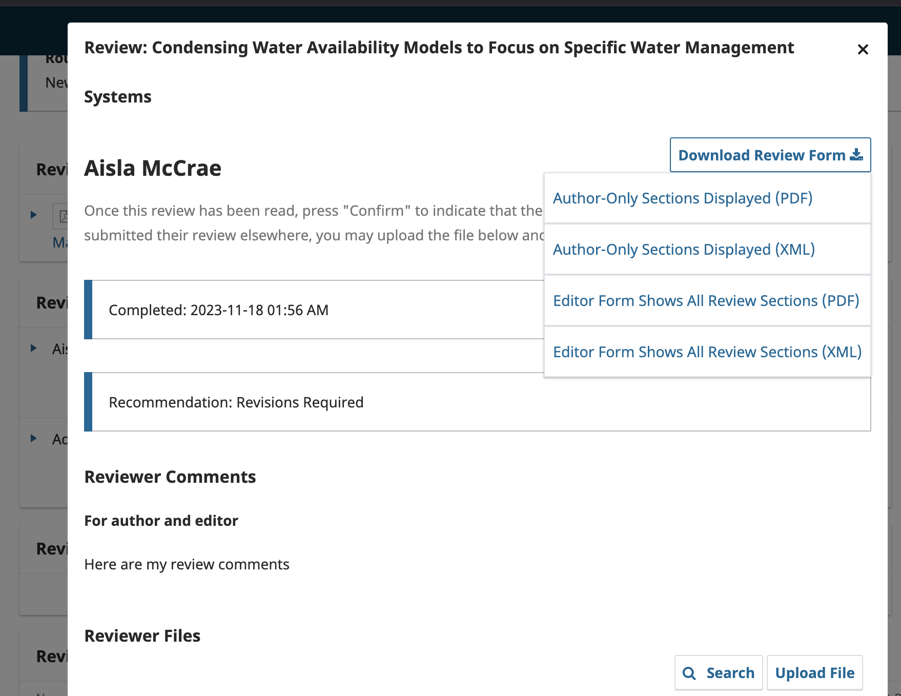

# OJS Download Reviews Plugin

This plugin adds the ability to download peer reviews in PDF and XML formats directly from the OJS platform.

## Features

- Export reviews in PDF and XML formats
- Integrates with the 'read review' modal
- Download reviews in formats suitable for archiving or external review

## Version Compatibility

- **Version 1.0.6**: Compatible with OJS 3.3
- **Version 1.1.2**: Compatible with OJS 3.4

> **Note**: OJS 3.5 will include this functionality in its core, so this plugin is recommended for versions 3.3 and 3.4 only.

## Requirements

- **PHP Dependency**: [mPDF](https://github.com/mpdf/mpdf) (for PDF generation)

### Installing mPDF

To install **mPDF**, run the following command in your terminal:

```bash
composer require mpdf/mpdf
```


